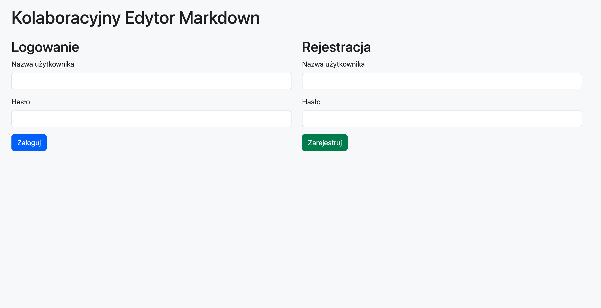
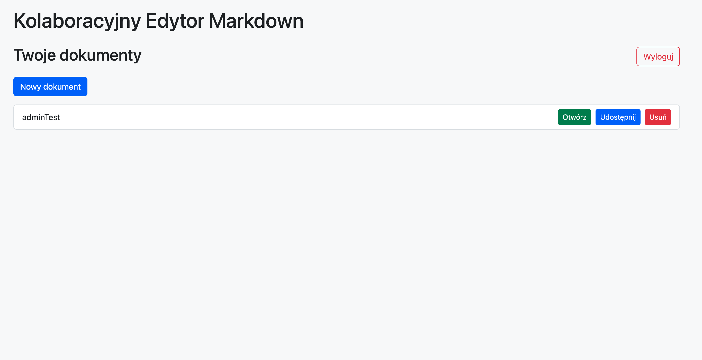
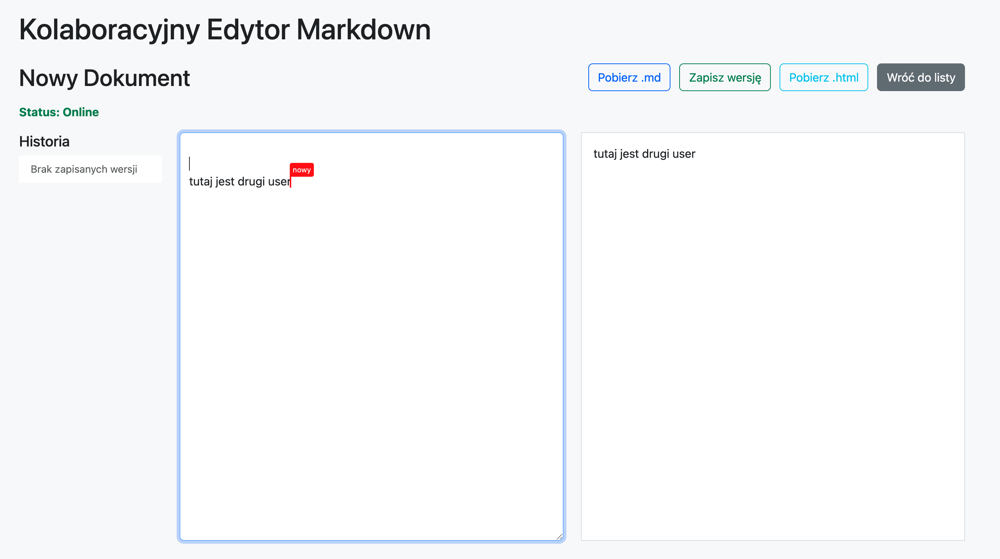

# Edytor Markdown

To jest serwerowa aplikacja webowa do zespołowej edycji plików Markdown w czasie rzeczywistym. Narzędzie rozwiązuje problem konfliktów zapisu podczas jednoczesnej pracy wielu osób.

## Główne funkcje
* Algorytm synchronizacji: Aplikacja oblicza dokładne różnice w tekście i wysyła tylko zmodyfikowane fragmenty.
* Praca bez sieci: Skrypt wykrywa brak połączenia z serwerem. Przeglądarka zapisuje zmiany w pamięci lokalnej. Odzyskanie sieci powoduje automatyczne wysłanie zaległych poprawek.
* Wskaźniki obecności: Ekran wyświetla graficzne kursory innych użytkowników oraz ich pozycje w dokumencie.
* Zarządzanie dostępem: System weryfikuje użytkowników za pomocą tokenów JWT. Role administracyjne pozwalają na zarządzanie plikami.
* Wersjonowanie plików: Użytkownik zapisuje migawki dokumentu i przywraca poprzednie wersje z panelu bocznego.
* Natywny eksport: Pobierasz gotowy dokument na swój dysk jako plik z rozszerzeniem md lub html.
* Podgląd na żywo: Skrypt renderuje formatowanie Markdown na bieżąco obok okna edytora.

## Technologie
* Serwer: Node.js oraz framework Express.
* Komunikacja: Protokół WebSocket zapewnia dwukierunkową wymianę wiadomości.
* Interfejs: Język JavaScript (ES Modules), HTML5 oraz CSS3. Biblioteka Bootstrap formatuje wygląd elementów.
* Baza danych: Pliki w formacie JSON przechowują informacje o użytkownikach, treściach dokumentów i historii wersji.

## Instalacja i uruchomienie
Wykonaj te kroki na swoim komputerze.

1. Sklonuj repozytorium na swój dysk.
2. Otwórz terminal w głównym katalogu projektu.
3. Wpisz polecenie npm install.
4. Wpisz polecenie npm run dev. Uruchomi ono serwer w trybie deweloperskim.
5. Otwórz przeglądarkę i wpisz adres http://localhost:3000.

## Zrzuty ekranu
* Zrzut ekranu 1: Ekran logowania 
* Zrzut ekranu 2: Lista dokumentów 
* Zrzut ekranu 3: Edytor z widocznymi kursorami współpracowników 

## Realizacja wymagań (mapowanie)
* Architektura: Skrypty używają ES Modules i podziału na moduły. Logika klienta oddzielona od logiki serwera.
* Czysty kod: Podział na foldery css/, js/, data/. Brak monolitu. Pliki mają poprawne nazwy.
* Asynchroniczność: Powszechne użycie async/await i fetch. Odpowiednia obsługa błędów try/catch.
* Zdarzenia DOM: Eventy podpięte przez addEventListener. Użyta delegacja zdarzeń na liście dokumentów.
* DOM API: Modyfikacje przez createElement i classList. Usunięto style inline.
* Formularze: Walidacja długości hasła podczas rejestracji z powiadomieniami o błędach w interfejsie.
* Wygląd: Aplikacja wdrożyła framework Bootstrap do stylów i semantyczne tagi HTML5.
* Repo: Zastosowano plik .gitignore i regularne commity.
* Konta: Rejestracja z hashowaniem bcrypt i logowanie JWT. Endpointy API chronione tokenem.
* Dokumenty: CRD (tworzenie, odczyt, usuwanie) realizowane z zapisem w JSON.
* WebSocket: Rozsyłanie operacji edycyjnych przez pakiet ws.
* CRDT/OT: Funkcja getDiff oraz applyDiff synchronizuje tekst i rozwiązuje podstawowe konflikty w czasie rzeczywistym.
* Obecność: Renderowanie kursorów reprezentujących precyzyjnie współrzędne innych użytkowników z wykorzystaniem elementu lustrzanego.
* Offline: Mechanizm zachowuje zmiany w localStorage i wznawia połączenie wykorzystując exponential backoff.
* Markdown: Renderowanie HTML na żywo z opóźnieniem 300ms używając funkcji debounce.
* Wersje: Endpoint zapisujący historię treści pliku z widocznym panelem i logiką przywracania dokumentu.
* Układ: Oddzielne poziomy uprawnień dla roli admin.